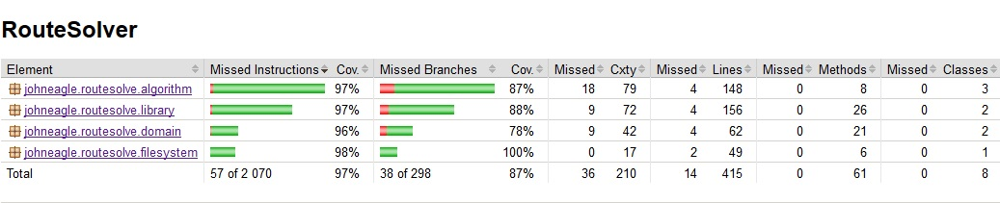

# Testausdokumentti

## Yksikkö testaus

Projektin testien rivikattavuus on 97% ja haarautumakattavuus on 87%. 



Haarautumakattavuuden osalta oma tekoiset tietorakenteet ovat heikoin alue projektista 83%. Tämä johtunee siitä, että tietorakenteiden kaikkien metodien vaihtoehtoja ei kannata jokaista testata erikseen eikä tule normaalisti vastaan. Näistä ei testatuista haarautumista monet kuitenkin ovat harvinaisia erityistapauksia, joten ne eivät ole olennaisia. 

Yksikkötesteille suoraan testattuja luokkia ovat luokat, joissa meodit tekevät jotakin yksinkertaisuudesta poikeavaa. Kaikki testit ovat toteutettu Junitilla, jolloin näiden toistaminen tapahtuu helposti mavenin avulla suorittamalla: _mvn test_.

### DataListTest ja MinHeapTest

Testaavat oma tekoisten tietorakenteiden operaatioita pyrkien simuloimaan sen yksinkertaista käyttöä. Kuitenkin varmistaen välttämättömät asiat yksinkertaisilla testeillä. 

Listaa ja pinoa simuloiva _DataList_ testataan erityisesti sen osalta, että se pitää tietueet alkuperäisessä järjestyksessä. Mistä seuraa, että mikä lisätään vikana voidaan poistaa ekana ja kaikki tietueet löydetään samassa järjestyksessä, kuin lisättiin. 

Taas minimikekoa simuloiva _MinHeap_ varmistetaan, että se tarjoaa lisäämisjärjestyksestä huolimatta pyydettäessä ensimmäisen arvon. Minimikeon kohdalla tämä tarkoittaa vertailun perusteella pienintä tietuetta, joka löytyy. 

### ReaderTest

On tarkoitus testata ohjelman tiedostonluku toiminnallisuutta varmistaakseen, että tiedosto luetaan oikein. Myös varmistaakseen, että epäonnistuessa virhe käsitellään oikein. 

### MapTest

Testaa luokan mikä sisältää varsinaisen kartan, jonka algoritmi saa. Sekä, joka huolehtii kartaan liittyvistä olennaisista operaatioista. Luokan kattava testaaminen ja toiminnan oikeellisuuden varmistaminen on hyvin olennaista. Sillä kyseisen luokan metodit ovat elintärkeitä algoritmin toimivuudelle. 

### FinderTest

Testaa itse varsinaiset reitti algoritmit. Tähän se käyttää valmiiksi luotua kartaa, jossa on pyritty simuloimaa valta osa yleisimmistä ongelma tapauksista. Molemmille algoritmeille suoritetaan samalla kartalla 8 reittiä, joiden ideaali tulos on laskettu käsin.

Käytetty kartta on seuraavanlainen

```
0000000000000000000000
0111111011011111110110
0000001010000000010100
0111101011111111010110
0010101001000101010010
0010101111000101011110
0010101001000101010010
0011101011110111010110
0010111010011101110100
0010101011000101010110
0110101001101101010010
0010111100001000010110
0010000100111010010000
0111111111101111110110
0000001010000000010100
0111101011001111010110
0010101001000101010010
0010101111111101011110
0010101001010101010010
0011101011010111010110
0010111010000101110100
0010101011010101010110
0110101001011101010010
0000000000000000000000
```

## Empiirinen Testaus

Ohjelman toimintaan on sisäänrakennettu komennot suorituskyky testausta varten. Komennot ovat _timeTest_ ja _memoryTest_ mitkä toimivat huolimatta suorittaako ohjelman suoraan lähdekoodina vai suoritettavan jarrina. 

Suoritusajan testaus on tapahtunut käyttämällä komentoa _timeTest_, joka suorittaa saman reitin haun 10 kertaa ja tulostaa jokaiseen kierrokseen menneen ajan. Kuitenkin niin, että jokaisen sarjan jälkeen sovellus on käynnistetty uudestaan, jotta vältettäisiin toistuvuudesta aiheutuva nopeutuminen, minkä tietokoneiden välimuisti aiheuttaa. 

