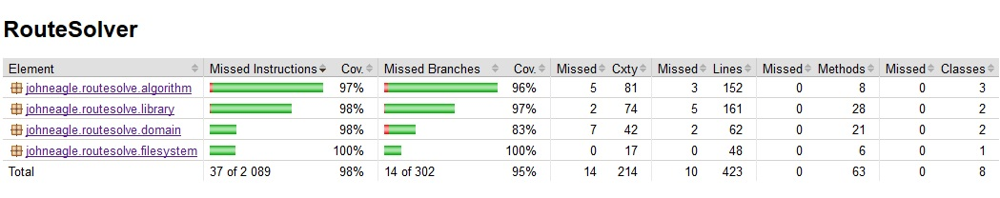
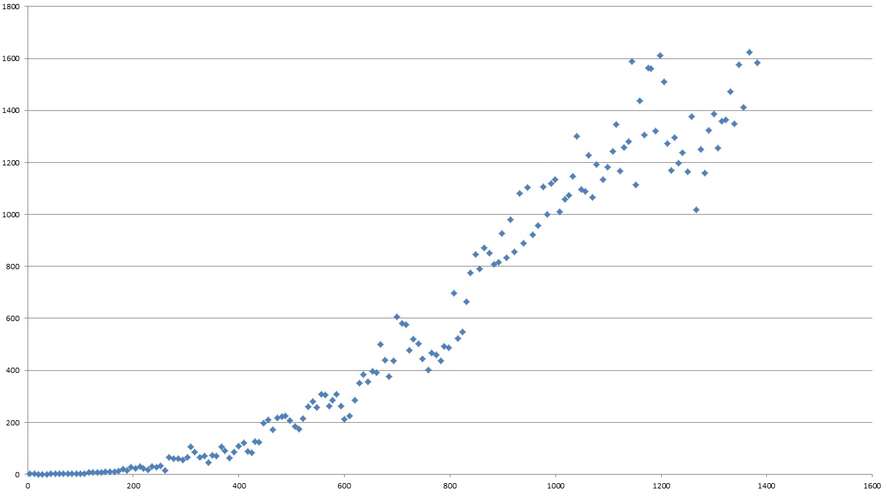
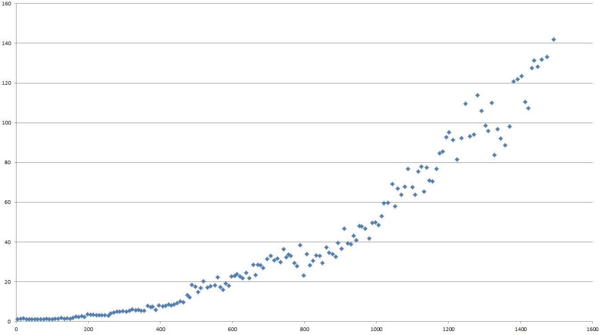
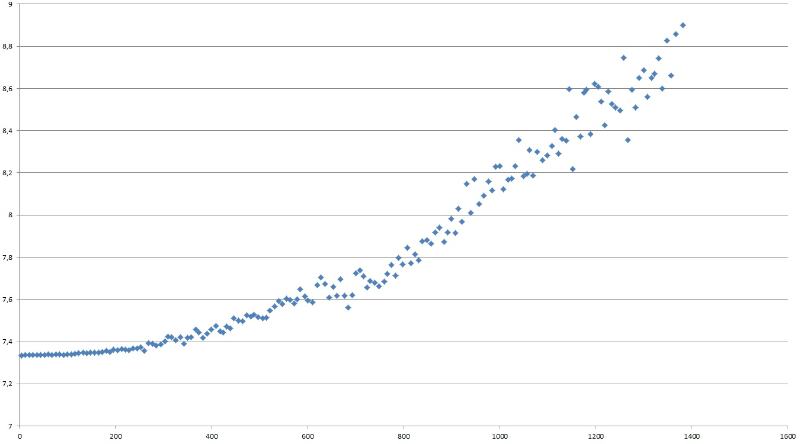

# Testausdokumentti

## Yksikkö testaus

Projektin testien rivikattavuus on 97% ja haarautumakattavuus on 87%. 



Haarautumakattavuuden osalta domain on heikoin alue projektista 78%. Monet haarautumista joita testeissä ei käydä läpi on hankala testata. Monesti ne ovat vain jokin erikoistapaus tai vähän käytetty toiminto. Näiden testaaminen kuitenkin voisi tulla oleelliseksi siinä tapauksessa, että niiden merkitys kasvaa. Sillä yleisesti ottaen haarautumakattavuus on kuitenkin hyvä olennaisissa osissa.

Yksikkötesteillä suoraan testattuja luokkia ovat luokat, joissa metodit tekevät jotakin yksinkertaisuudesta poikeavaa. Kaikki testit ovat toteutettu Junitilla, jolloin näiden toistaminen tapahtuu helposti mavenin avulla suorittamalla: _mvn test_.

### DataListTest ja MinHeapTest

Testaavat oma tekoisten tietorakenteiden operaatioita pyrkien simuloimaan sen yksinkertaista käyttöä. Kuitenkin varmistaen välttämättömät asiat yksinkertaisilla testeillä. 

Listaa ja pinoa simuloiva _DataList_ testataan erityisesti sen osalta, että se pitää tietueet alkuperäisessä järjestyksessä. Mistä seuraa, että mikä lisätään vikana voidaan poistaa ekana ja kaikki tietueet löydetään samassa järjestyksessä, kuin lisättiin. 

Taas minimikekoa simuloiva _MinHeap_ varmistetaan, että se tarjoaa lisäämisjärjestyksestä huolimatta pyydettäessä ensimmäisen arvon. Minimikeon kohdalla tämä tarkoittaa vertailun perusteella pienintä tietuetta, joka löytyy. 

### ReaderTest

On tarkoitus testata ohjelman tiedostonluku toiminnallisuutta varmistaakseen, että tiedosto luetaan oikein. Myös varmistaakseen, että epäonnistuessa virhe käsitellään oikein. 

### MapTest

Testaa luokan mikä sisältää varsinaisen kartan, jonka algoritmi saa. Sekä, joka huolehtii kartaan liittyvistä olennaisista operaatioista. Luokan kattava testaaminen ja toiminnan oikeellisuuden varmistaminen on hyvin olennaista. Sillä kyseisen luokan metodit ovat elintärkeitä algoritmin toimivuudelle. 

### AstarTest ja JPSTest

Testaavat itse varsinaiset reitti algoritmit. Tähän ne käyttää valmiiksi luotua kartaa, jossa on pyritty simuloimaa valta osa yleisimmistä ongelma tapauksista. Molemmille algoritmeille suoritetaan samalla kartalla 8 reittiä, joiden ideaali tulos on laskettu käsin.

Käytetty kartta on seuraavanlainen

```
0000000000000000000000
0111111011011111110110
0000001010000000010100
0111101011111111010110
0010101001000101010010
0010101111000101011110
0010101001000101010010
0011101011110111010110
0010111010011101110100
0010101011000101010110
0110101001101101010010
0010111100001000010110
0010000100111010010000
0111111111101111110110
0000001010000000010100
0111101011001111010110
0010101001000101010010
0010101111111101011110
0010101001010101010010
0011101011010111010110
0010111010000101110100
0010101011010101010110
0110101001011101010010
0000000000000000000000
```

## Suorituskyky testaus

### Tausta

Suorituskyky testaus on toteutettu sisäänrakennetusti ohjelmaan. Näihin pääsee käsiksi ohjelmaa suorittaessa antamalla oikeat parametrit suorituskäskyn perään. Tarvittavat 4 parametria ovat

```
java -jar *jar-tiedoston nimi* *kartta* *reitit* *testin tyyppi* *algoritmi*
```

Missä "jar tiedoston nimi" on oletus arvoisesti _RouteSolver-1.0-SNAPSHOT.jar_, jos se on generoitu projekti koodista. Taas "kartta" tarkoittaa tiedoston nimeä, jossa ascii kartta on. "reitit" sen sijaan edustaa tiedostoa, jossa kaikki kartan testattavat reitit löytyvät. "testin tyyppi" on joko _time_ tai _memory_ ja "algoritmi" on joko _a*_ tai _jps_. Jos parametrit eivät ole valideja, niin ohjelma vain antaa ilmoituksen virheestä tai ei tee mitään. Reitti tiedoston formaatti on seuraavanlainen

```
*neljä sanaa/numeroa* *lähtö x* *lähtö y* *maali x* *maali y*
*neljä sanaa/numeroa* *lähtö x* *lähtö y* *maali x* *maali y*
*neljä sanaa/numeroa* *lähtö x* *lähtö y* *maali x* *maali y*
*neljä sanaa/numeroa* *lähtö x* *lähtö y* *maali x* *maali y*
```

Alussa pitää olla neljä vapaa valintaista 'sanaa/numeroa' ja välilyöntien tilalla pitää olla tabi. Sillä tällöin, jos käyttää esim. MovingAILabin valmiita scenaario tiedostoja ja karttoja, niin scenaario tiedostoille ei tarvitse tehdä mitään.

### Toteutus

Suorituskyky testaus muistin ja suoritusajan osalta A* ja JPS tehtiin viiden kartan kohdalla lukuisilla reiteillä. Kartat löytyvät [täältä](https://github.com/Jhoneagle/RouteSolver/blob/master/documentation/performanceMaps) ja scenaariot eli reitit löytyvät niihin [täältä](https://github.com/Jhoneagle/RouteSolver/blob/master/documentation/performanceRoutes). 

Kuvaajia varten dataa jouduttiin kuitenkin supistamaan ennen piirtoa. Aluksi kaikki järjestettiin reitin pituuden mukaan pienimmästä suurinpaan. Tämän jälkeen kahdessa pienemmässä kartassa: aina kuuden peräkäisen ajan keston/käytetyn muistin sekä reitin pituuden arvoista laskettiin keskiarvo. Taas y512x512 tehtiin samoin, mutta aina kymmenen peräkäisen kohdalla ja kahdessa viimeisessä sen sijaan 20 välein. Näin saatiin klusteroitua läheisten pituuksien suorituskyky tuloksia yhteen ja samalla tasoitettua merkittävimpiä poikeamia pois. Kuvaajissa y-akselina on joko suoritusaika tai käytetty muisti ja x-akseli on polun pituus. y-akselin yksikkö on suoritusajassa _millisekunteina_ ja _megatavuina_ muistin käytössä. 

### Tulokset

#### y141x162.map

Suoritus ajat eri polunpituuksilla, kun Jump point search eli JPS.


Suoritus ajat eri polunpituuksilla, kun käytössä sen sijaan A*.


Algoritmin käyttämä muisti eri polunpituuksilla, kun Jump point search eli JPS.


Algoritmin käyttämä muisti eri polunpituuksilla, kun käytössä sen sijaan A*.


#### y261x314.map

Suoritus ajat eri polunpituuksilla, kun Jump point search eli JPS.


Suoritus ajat eri polunpituuksilla, kun käytössä sen sijaan A*.


Algoritmin käyttämä muisti eri polunpituuksilla, kun Jump point search eli JPS.


Algoritmin käyttämä muisti eri polunpituuksilla, kun käytössä sen sijaan A*.


#### y512x512.map

Suoritus ajat eri polunpituuksilla, kun Jump point search eli JPS.


Suoritus ajat eri polunpituuksilla, kun käytössä sen sijaan A*.


Algoritmin käyttämä muisti eri polunpituuksilla, kun Jump point search eli JPS.


Algoritmin käyttämä muisti eri polunpituuksilla, kun käytössä sen sijaan A*.


#### y768x768.map

Suoritus ajat eri polunpituuksilla, kun Jump point search eli JPS.



Suoritus ajat eri polunpituuksilla, kun käytössä sen sijaan A*.



Algoritmin käyttämä muisti eri polunpituuksilla, kun Jump point search eli JPS.



Algoritmin käyttämä muisti eri polunpituuksilla, kun käytössä sen sijaan A*.


#### y1024x1024.map

Suoritus ajat eri polunpituuksilla, kun Jump point search eli JPS.


Suoritus ajat eri polunpituuksilla, kun käytössä sen sijaan A*.


Algoritmin käyttämä muisti eri polunpituuksilla, kun Jump point search eli JPS.


Algoritmin käyttämä muisti eri polunpituuksilla, kun käytössä sen sijaan A*.


